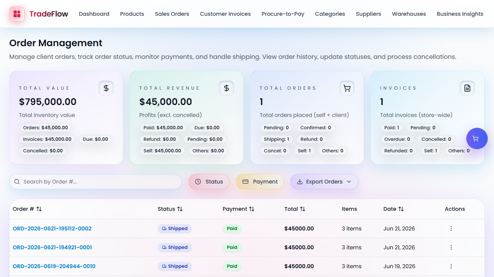

# ERP TradeFlow (BPMN 1-to-1 Alignment)

> **Tugas Mata Kuliah Sistem Enterprise**  
> Acuan proses utama: **BPMN TradeFlow & NetSuite**  
> Fokus wajib: **O2C, P2P, dan Inventory Management**

Repositori ini adalah implementasi *end-to-end* aplikasi enterprise berbasis `Next.js + Prisma + MongoDB`. Sistem ini telah secara ketat diselaraskan agar memiliki kecocokan **1-to-1 dengan spesifikasi BPMN (TradeFlow_BPMN.pdf)**, baik dari segi alur proses (langkah demi langkah) maupun otorisasi peran (*Roles*).

---

## 1. Otorisasi Peran Berbasis BPMN (Roles)

Untuk menjamin alur bisnis yang sesuai spesifikasi, sistem hanya mengakomodasi Entitas Peran (Roles) mutlak berikut ini (seluruh entitas tidak valid seperti *ap_analyst* atau *accounting_manager* telah dihapus):

- **`Sales Representative`**: Membuka Sales Order baru.
- **`Sales Manager`**: Memberikan Approval pada Sales Order.
- **`Inventory Manager`**: Melakukan Pick, Pack, Ship, Receive Item, Adjust Inventory, Transfer Inventory.
- **`A/R Analyst`**: Menerbitkan Invoice, Mencatat Customer Payment, Membuat Vendor Bill, Approve Vendor Bill, dan Bill Payment.
- **`Purchasing Manager`**: Membuat Purchase Order.
- **`Warehouse Staff`**: Staf operasional inventori lapangan.

---

## 2. Order-to-Cash (O2C)

Alur **O2C** telah dipecah secara ketat agar mencerminkan proses riil di lapangan.

1. **Create Sales Order (Oleh Sales Rep) & Approve (Oleh Sales Manager)**
   Sistem memastikan *oversell prevention* dan otorisasi *approval* ketat sebelum barang bisa diproses.
   > 

2. **Item Fulfillment (Oleh Inventory Manager)**
   Proses fulfillment dilakukan dalam 3 tahap presisi (Pick -> Pack -> Ship).
   > 

3. **Customer Invoice (Oleh A/R Analyst)**
   Penagihan hanya digenerate dari *quantity* yang sudah di-*fulfill*.
   > 

4. **Customer Payment (Oleh A/R Analyst)**
   Mencatat pembayaran *partial* maupun *full*.
   > 

---

## 3. Procure-to-Pay (P2P)

Alur **P2P** mengikat otorisasi *Role-Based Access Control* (RBAC) pada antarmuka *Procurement Workbench*.

1. **Purchase Order (Oleh Purchasing Manager)**
   Proses pembuatan PO untuk vendor.
   > 

2. **Item Receipt (Oleh Inventory Manager)**
   Penerimaan barang dari vendor yang secara otomatis menambah stok gudang.
   > 

3. **Vendor Bill (Oleh A/R Analyst)**
   Pembuatan *Vendor Bill* berdasarkan PO dan *Item Receipt* yang disahkan.
   > 

4. **Bill Payment (Oleh A/R Analyst)**
   Pembayaran ke vendor berdasarkan *Vendor Bill*.
   > 

---

## 4. Inventory Management

Pengaturan *Inventory* juga dilimitasi secara ketat.

1. **Inventory Transfer (Oleh Inventory Manager)**
   Mentransfer stok antar gudang dari *pending* ke *completed*.
   > 

2. **Inventory Issue (Oleh Inventory Manager)**
   Pengeluaran barang secara manual dengan mekanisme pembatalan (*reverse issue*).
   > 

3. **Inventory Ledger Integrity**
   Memastikan pencatatan jurnal mutasi inventori tetap sinkron dan utuh.
   > 

4. **Legacy Compatibility Regression**
   Menjaga sistem agar tidak regresi terhadap kompabilitas API terdahulu.
   > 

---

## 5. Status Implementasi Teknis & E2E Testing

Aplikasi dibangun menggunakan infrastruktur modern dengan kualitas setara produksi:

- **Stack:** `Next.js 16`, `React 19`, `Prisma`, `MongoDB`, `Tailwind CSS`.
- **Testing Coverage:**
  - **Unit Testing:** `Vitest` (324 test lolos sempurna, menguji validasi, limitasi PO, dll).
  - **E2E Testing:** `Playwright` (Simulasi login multi-peran dan navigasi flow otomatis untuk 12 *Test Scenarios* O2C, P2P, dan Inventory).
- **Code Quality:** Terverifikasi bebas *type error* (TypeScript ketat) dan lulus *Linting*.

---

## 6. Cara Menjalankan Project

1. **Install Dependencies:**
   ```bash
   npm install
   ```

2. **Setup Database (MongoDB):**
   Ubah `DATABASE_URL` di `.env` (atau jalankan MongoDB lokal via Docker/Homebrew).

3. **Migrate / Push Schema:**
   ```bash
   npx prisma db push
   ```

4. **Seed Demo Accounts (Generate User Roles):**
   ```bash
   npx tsx scripts/create-demo-accounts.ts
   ```

5. **Jalankan Aplikasi:**
   ```bash
   npm run dev
   ```

6. **Login Akun:**
   Gunakan email demo seperti `salesmgr@demo.com` atau `aranalyst@demo.com` dengan password `12345678` untuk menguji batasan hak akses sesuai dokumen BPMN.
