# ERP TradeFlow (BPMN 1-to-1 Alignment)

> **Tugas Mata Kuliah Sistem Enterprise**  
> Acuan proses utama: **BPMN TradeFlow & NetSuite**  
> Fokus wajib: **Order-to-Cash (O2C), Procure-to-Pay (P2P), dan Inventory Management**

Repositori ini adalah implementasi *end-to-end* aplikasi enterprise berbasis `Next.js + Prisma + MongoDB`. Sistem ini telah secara ketat diselaraskan agar memiliki kecocokan **1-to-1 dengan spesifikasi BPMN (TradeFlow_BPMN.pdf)**, baik dari segi alur proses (langkah demi langkah) maupun otorisasi peran (*Roles*).

---

## 1. Arsitektur Proses — TradeFlow BPMN Overview

Diagram di bawah menunjukkan alur **End-to-End proses TradeFlow** (Level 0) yang menjadi acuan utama implementasi.

> **BPMN Level 0 — End-to-End TradeFlow System**
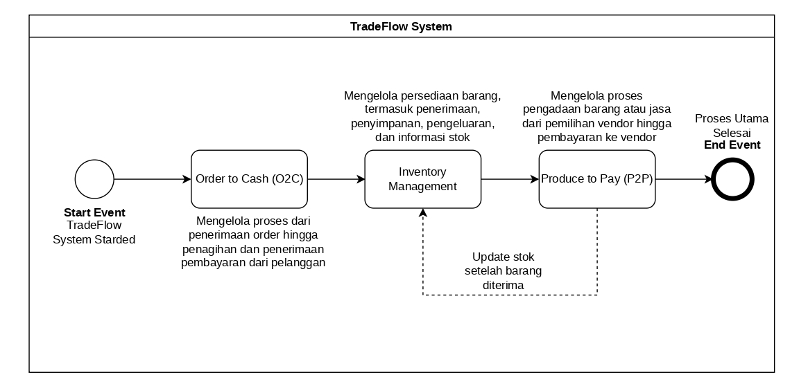

---

## 2. Otorisasi Peran Berbasis BPMN (Roles)

Untuk menjamin alur bisnis yang sesuai spesifikasi, sistem hanya mengakomodasi Entitas Peran (Roles) mutlak berikut ini:

| Role | Tanggung Jawab |
|---|---|
| **Sales Representative** | Membuka Sales Order baru |
| **Sales Manager** | Memberikan Approval pada Sales Order |
| **Inventory Manager** | Pick, Pack, Ship, Receive Item, Adjust & Transfer Inventory |
| **A/R Analyst** | Invoice, Customer Payment, Vendor Bill, Bill Payment |
| **Purchasing Manager** | Membuat Purchase Order |
| **Warehouse Staff** | Review Item, Update Inventory Receipt |

---

## 3. Order-to-Cash (O2C)

### BPMN Diagram — O2C Level 1

Diagram swimlane di bawah menunjukkan **alur lengkap O2C** per peran sesuai spesifikasi BPMN.

> **BPMN Level 1 — Order-to-Cash Process**
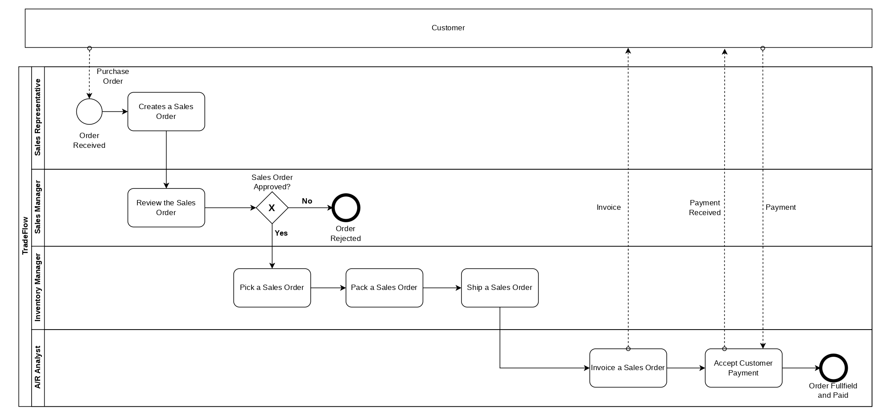

---

### Step 1 — Creates a Sales Order
> **Actor:** Sales Representative  
> Menerima Purchase Order dari pelanggan (trigger: *Order Received*) dan memasukkan data pesanan ke dalam sistem sebagai *Sales Order*. Sistem mencegah *oversell* secara otomatis.


---

### Step 2 — Review & Approve the Sales Order
> **Actor:** Sales Manager  
> Memvalidasi detail pesanan (stok tersedia, harga, kuantitas). Jika disetujui → lanjut ke fulfillment. Jika ditolak → *Order Rejected* (End Event).

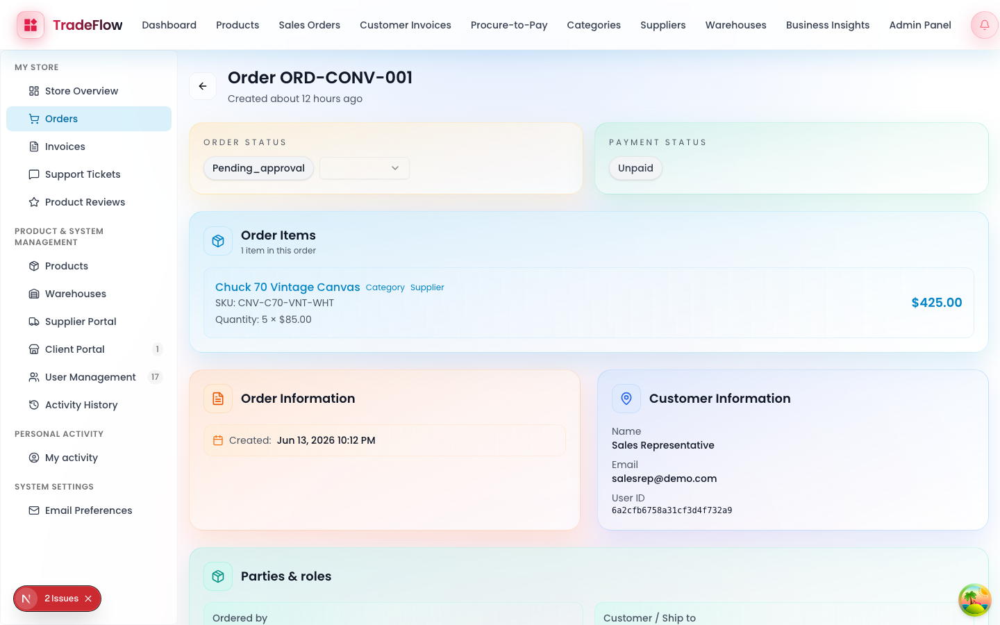

---

### Step 3 — Pick → Pack → Ship a Sales Order
> **Actor:** Inventory Manager  
> Melakukan pemenuhan pesanan secara bertahap: **Pick → Pack → Ship**. Status inventori otomatis teralokasi dan berkurang saat setiap tahap diselesaikan.

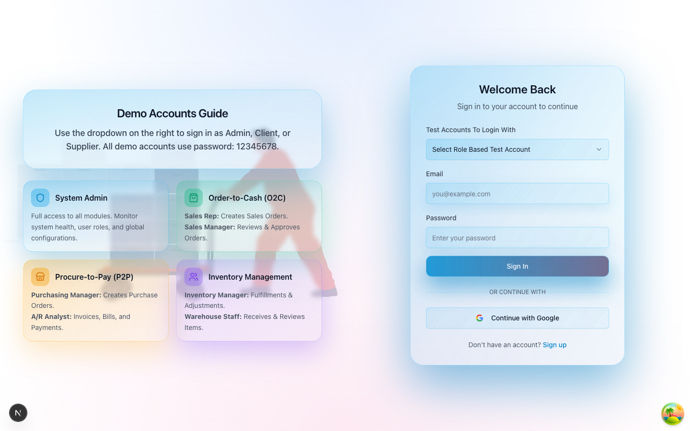

---

### Step 4 — Invoice a Sales Order
> **Actor:** A/R Analyst  
> Menerbitkan *Customer Invoice* berdasarkan kuantitas yang telah di-ship. Invoice dikirim ke Customer (dokumen dashed line ke Customer lane).

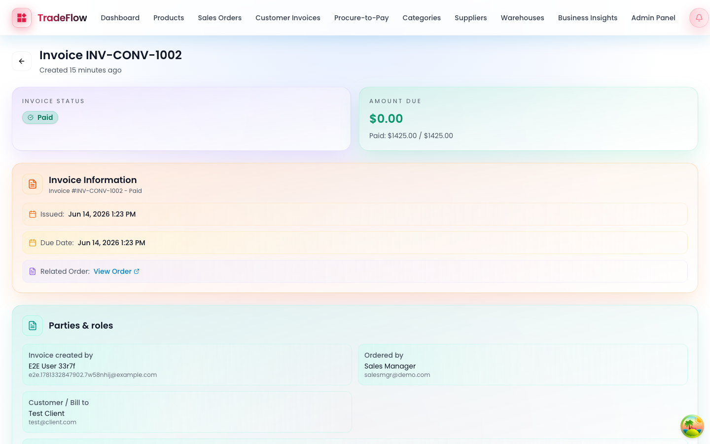

---

### Step 5 — Accept Customer Payment
> **Actor:** A/R Analyst  
> Mencatat penerimaan pembayaran dari pelanggan. Mendukung partial maupun full payment. Proses selesai: *Order Fulfilled and Paid* (End Event).


---

## 4. Procure-to-Pay (P2P)

### BPMN Diagram — P2P Level 1

Diagram swimlane di bawah menunjukkan **alur lengkap P2P** per peran sesuai spesifikasi BPMN.

> **BPMN Level 1 — Procure-to-Pay Process**
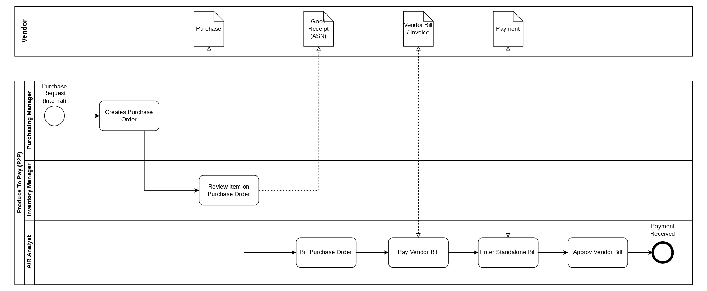

---

### Step 1 — Creates Purchase Order
> **Actor:** Purchasing Manager  
> Membuat *Purchase Order* atas dasar *Purchase Request* internal dan mengirimkannya ke vendor (dokumen Purchase dashed ke Vendor lane).

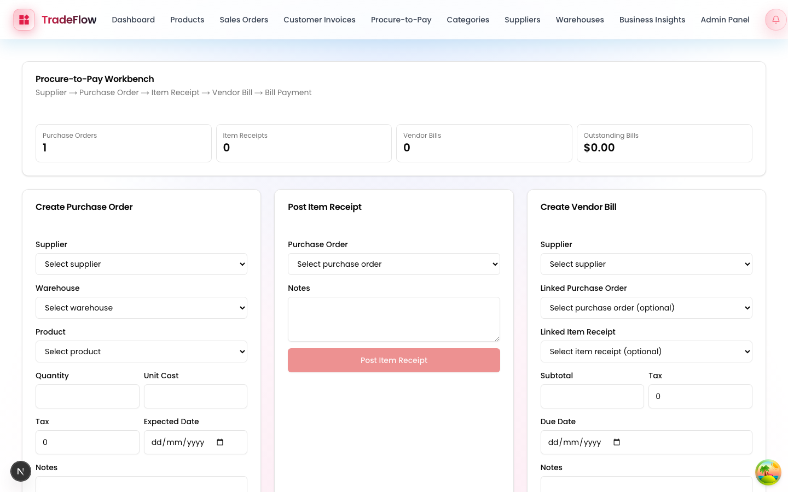

---

### Step 2 — Review Item on Purchase Order
> **Actor:** Inventory Manager  
> Menerima barang fisik di gudang (*Item Receipt / Good Receipt ASN*) dan memvalidasi item sesuai PO. Stok produk otomatis meningkat.

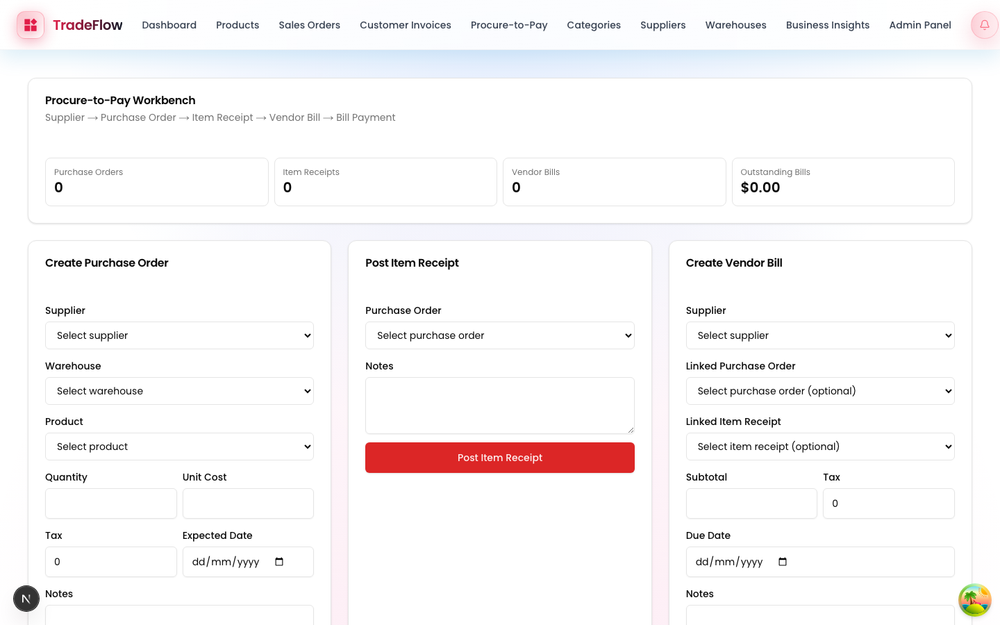

---

### Step 3 — Bill Purchase Order (Enter Vendor Bill)
> **Actor:** A/R Analyst  
> Memasukkan tagihan vendor (*Vendor Bill / Invoice*) ke dalam sistem, menghubungkannya ke PO dan Good Receipt. Dokumen Vendor Bill dikirim ke Vendor.


---

### Step 4 — Pay Vendor Bill
> **Actor:** A/R Analyst  
> Melakukan pembayaran tagihan ke vendor. Mendukung pembayaran parsial maupun penuh. Proses selesai saat *Payment Received* (End Event).


---

## 5. Item Management (Inventory)

### BPMN Diagram — Inventory Management Level 1

Diagram swimlane di bawah menunjukkan **alur lengkap Inventory Management** per peran sesuai spesifikasi BPMN.

> **BPMN Level 1 — Inventory Management Process**
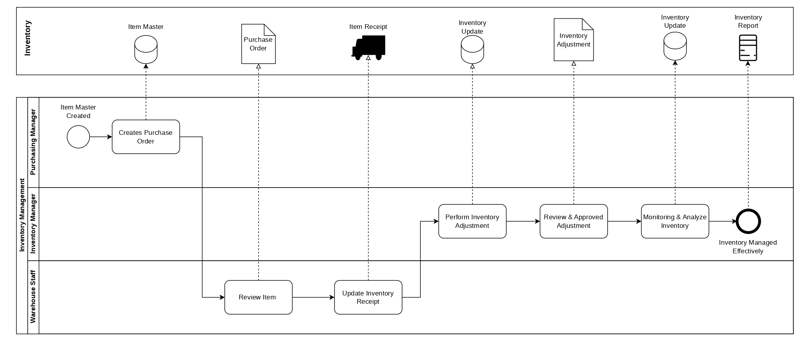

---

### Step 1 — Creates Purchase Order (Item Master)
> **Actor:** Purchasing Manager  
> Membuat Purchase Order berdasarkan *Item Master Created*. Data Item Master tersimpan di sistem inventori.

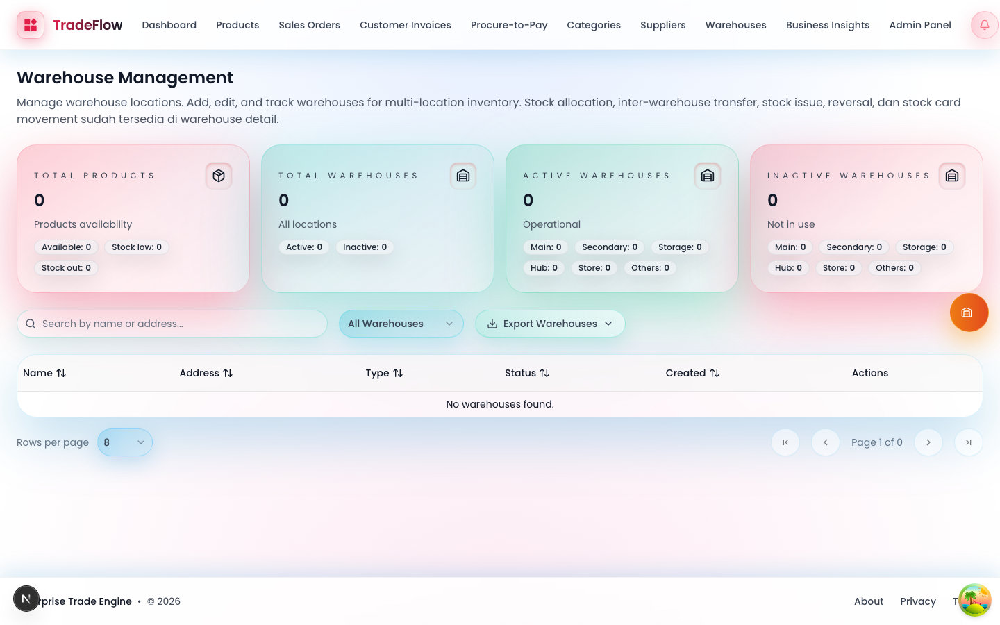

---

### Step 2 — Review Item & Update Inventory Receipt
> **Actor:** Warehouse Staff  
> Menerima barang, me-*review item* sesuai PO, lalu mengupdate *Inventory Receipt*. Stok sistem diperbarui secara otomatis.


---

### Step 3 — Perform Inventory Adjustment
> **Actor:** Inventory Manager  
> Melakukan penyesuaian stok manual (*Inventory Adjustment*) untuk pengeluaran barang, koreksi stok, atau transfer antar gudang. Mendukung *Reverse* untuk koreksi.

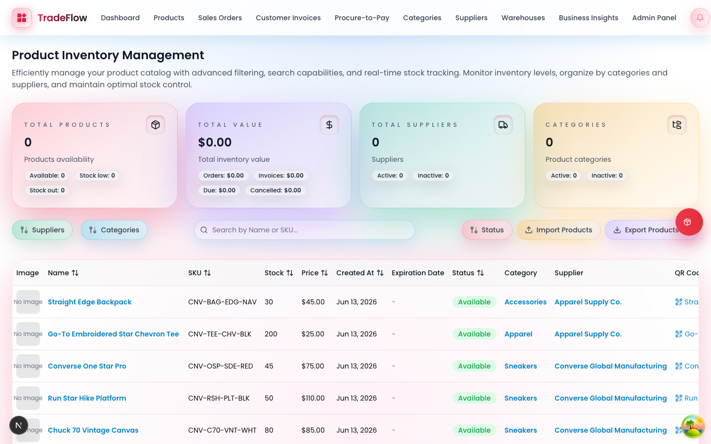

---

### Step 4 — Review & Approved Adjustment
> **Actor:** Inventory Manager  
> Memvalidasi dan menyetujui hasil adjustment inventori.

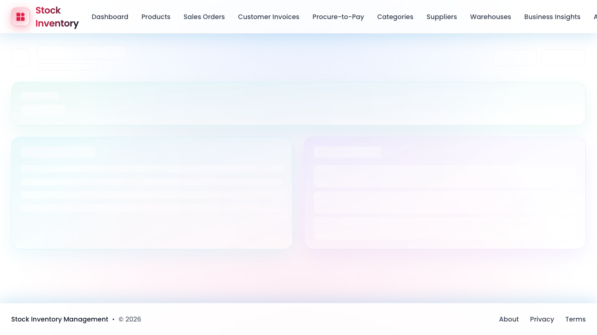

---

### Step 5 — Monitoring & Analyze Inventory
> **Actor:** Inventory Manager  
> Memantau seluruh pergerakan stok melalui *Inventory Ledger* dan laporan inventori. Proses selesai: *Inventory Managed Effectively* (End Event).

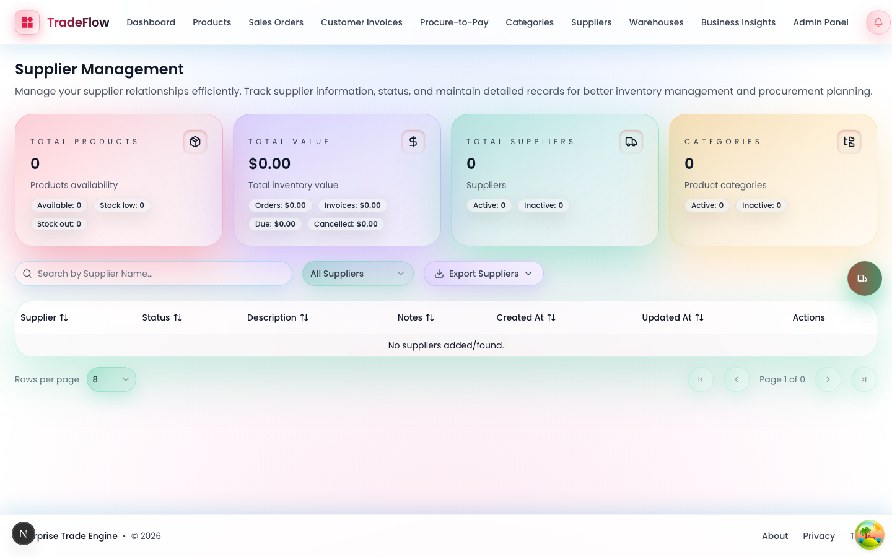

---

## 6. Status Implementasi Teknis & E2E Testing

| Aspek | Status |
|---|---|
| **Framework** | Next.js 16, React 19, Prisma, MongoDB, Tailwind CSS |
| **Unit Testing** | ✅ Vitest — 324 tests lolos (validasi, PO limits, dll) |
| **E2E Testing** | ✅ Playwright — 12 Test Scenarios (TS-01 s.d. TS-12) |
| **BPMN Screenshots** | ✅ 15 screenshots per BPMN activity (O2C, P2P, Inventory) |
| **BPMN Diagrams** | ✅ 4 diagram JPG (Level 0, O2C, P2P, Inventory Management) |
| **TypeScript** | ✅ Bebas type error, strict mode |
| **Build** | ✅ Production build sukses |

---

## 7. Cara Menjalankan Project

1. **Install Dependencies:**
   ```bash
   npm install
   ```

2. **Setup Database (MongoDB):**
   Ubah `DATABASE_URL` di `.env` (atau jalankan MongoDB lokal via Docker/Homebrew).

3. **Migrate / Push Schema:**
   ```bash
   npx prisma db push
   ```

4. **Seed Demo Accounts (Generate User Roles):**
   ```bash
   npx tsx scripts/create-demo-accounts.ts
   ```

5. **Jalankan Aplikasi:**
   ```bash
   npm run dev
   ```

6. **Login Akun:**
   Gunakan email demo seperti `salesmgr@demo.com` atau `aranalyst@demo.com` dengan password `12345678` untuk menguji batasan hak akses sesuai dokumen BPMN.

7. **Regenerate BPMN Screenshots:**
   ```bash
   npx playwright test tests/e2e/bpmn-screenshots.spec.ts
   ```
