# ERP TradeFlow (BPMN 1-to-1 Alignment)

> **Tugas Mata Kuliah Sistem Enterprise**  
> Acuan proses utama: **BPMN TradeFlow & NetSuite**  
> Fokus wajib: **Order-to-Cash (O2C), Procure-to-Pay (P2P), dan Inventory Management**

Repositori ini adalah implementasi *end-to-end* aplikasi enterprise berbasis `Next.js + Prisma + MongoDB`. Sistem ini telah secara ketat diselaraskan agar memiliki kecocokan **1-to-1 dengan spesifikasi BPMN (TradeFlow_BPMN.pdf)**, baik dari segi alur proses (langkah demi langkah) maupun otorisasi peran (*Roles*).

---

## 1. Otorisasi Peran Berbasis BPMN (Roles)

Untuk menjamin alur bisnis yang sesuai spesifikasi, sistem hanya mengakomodasi Entitas Peran (Roles) mutlak berikut ini:

- **`Sales Representative`**: Membuka Sales Order baru.
- **`Sales Manager`**: Memberikan Approval pada Sales Order.
- **`Inventory Manager`**: Melakukan Pick, Pack, Ship, Receive Item, Adjust Inventory, Transfer Inventory.
- **`A/R Analyst`**: Menerbitkan Invoice, Mencatat Customer Payment, Membuat Vendor Bill, Approve Vendor Bill, dan Bill Payment.
- **`Purchasing Manager`**: Membuat Purchase Order.
- **`Warehouse Staff`**: Staf operasional inventori lapangan.

---

## 2. Order-to-Cash (O2C)

Proses O2C telah dirancang untuk mencerminkan aliran kerja secara presisi sesuai dengan model BPMN.

### 2.1 Receive Purchase Order & Create Sales Order
- **Actor**: Sales Representative
- **Aktivitas**: Menerima PO dari pelanggan dan memasukkan data pesanan ke dalam sistem sebagai *Sales Order* dengan status *Pending Approval*.
> 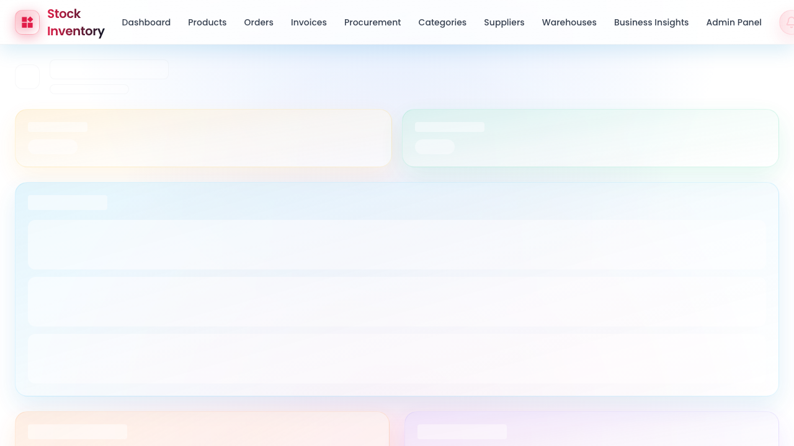

### 2.2 Approve Sales Order
- **Actor**: Sales Manager
- **Aktivitas**: Memvalidasi pesanan, memastikan ketersediaan stok (*oversell prevention*), dan menyetujui pesanan.
> 

### 2.3 Fulfill Sales Order
- **Actor**: Inventory Manager
- **Aktivitas**: Mengelola pemenuhan pesanan secara bertahap melalui proses *Pick, Pack, dan Ship*. Status inventori akan otomatis teralokasi dan berkurang.
> 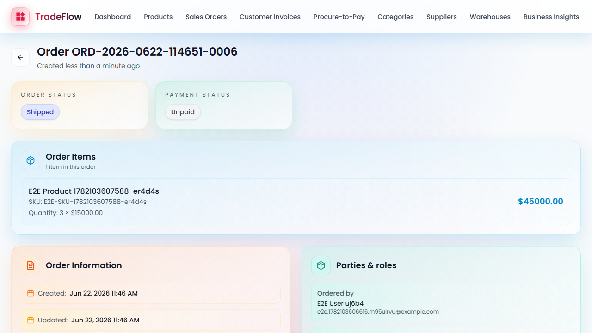

### 2.4 Invoice Customer
- **Actor**: A/R Analyst
- **Aktivitas**: Menerbitkan tagihan (*Customer Invoice*) kepada pelanggan berdasarkan kuantitas barang yang telah dipenuhi (*fulfilled quantity*).
> 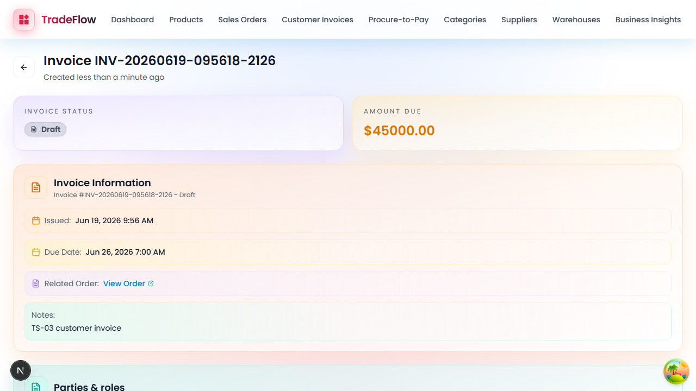

### 2.5 Receive Customer Payment
- **Actor**: A/R Analyst
- **Aktivitas**: Mencatat penerimaan pembayaran dari pelanggan, memproses pembayaran parsial maupun lunas, serta menutup piutang.
> 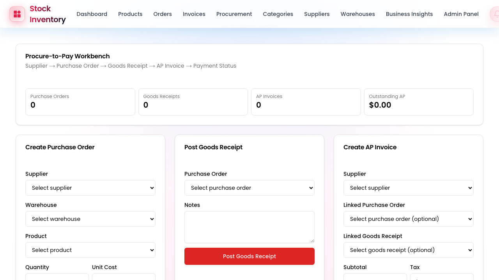

---

## 3. Procure-to-Pay (P2P)

Alur P2P dikendalikan penuh oleh antarmuka *Procurement Workbench* dengan otorisasi berbasis peran (RBAC).

### 3.1 Create Purchase Order
- **Actor**: Purchasing Manager
- **Aktivitas**: Membuat *Purchase Order* untuk memesan barang dari vendor untuk menambah persediaan.
> 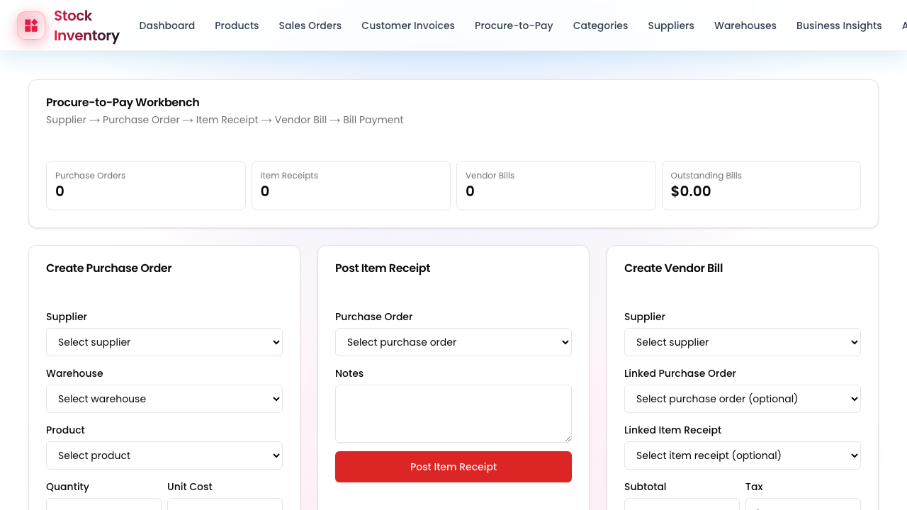

### 3.2 Receive Items
- **Actor**: Inventory Manager
- **Aktivitas**: Menerima barang fisik di gudang (*Item Receipt*) yang secara langsung meningkatkan jumlah stok yang tersedia.
> 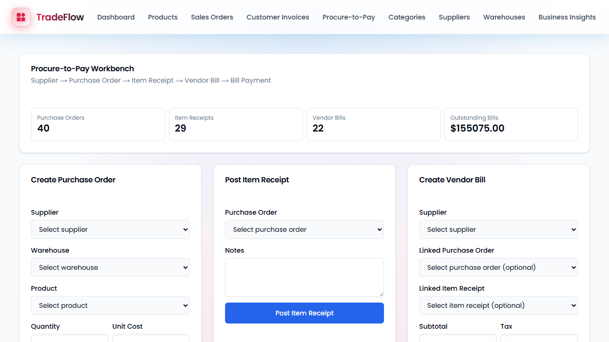

### 3.3 Enter Vendor Bill
- **Actor**: A/R Analyst
- **Aktivitas**: Memasukkan tagihan vendor (*Vendor Bill*) ke dalam sistem untuk memvalidasi tagihan berdasarkan dokumen penerimaan barang.
> 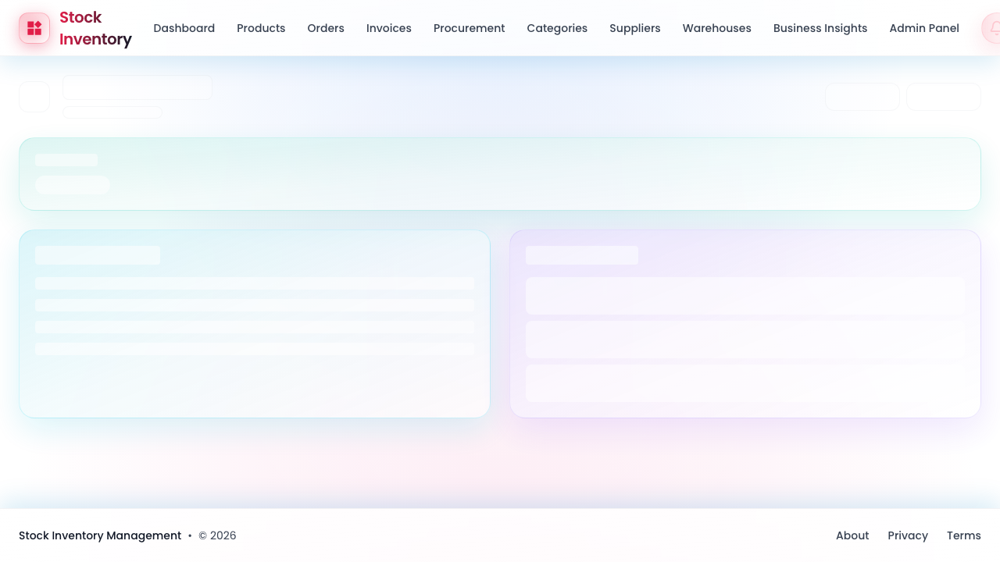

### 3.4 Pay Bill
- **Actor**: A/R Analyst
- **Aktivitas**: Melakukan pembayaran tagihan ke vendor, mengelola status pembayaran (parsial/penuh), dan menyelesaikan kewajiban.
> 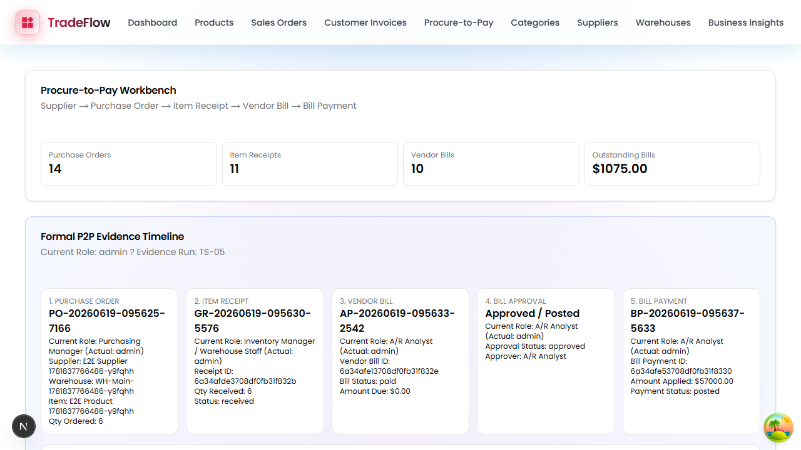

---

## 4. Item Management (Inventory)

Proses manajemen inventaris juga dipisahkan secara ketat untuk menjaga integritas data logistik.

### 4.1 Adjust Inventory
- **Actor**: Inventory Manager
- **Aktivitas**: Melakukan penyesuaian stok manual (*Inventory Issue*) untuk pengeluaran barang tanpa penjualan (misal: barang rusak) lengkap dengan fitur *Reverse Issue*.
> 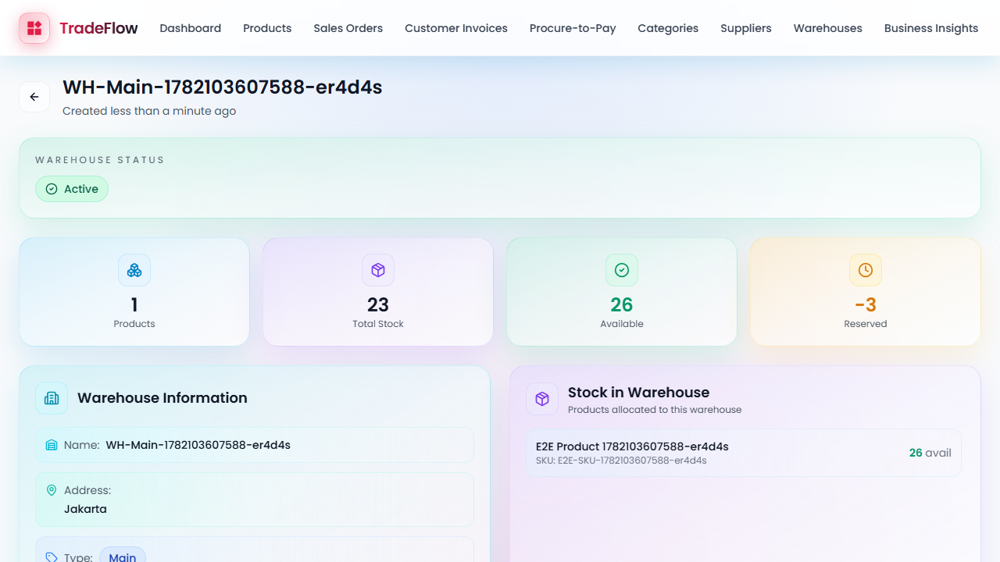

### 4.2 Transfer Inventory
- **Actor**: Inventory Manager
- **Aktivitas**: Mentransfer stok barang antar gudang (*Inventory Transfer*), dari tahap pemesanan hingga barang tiba dan status transfer selesai.
> 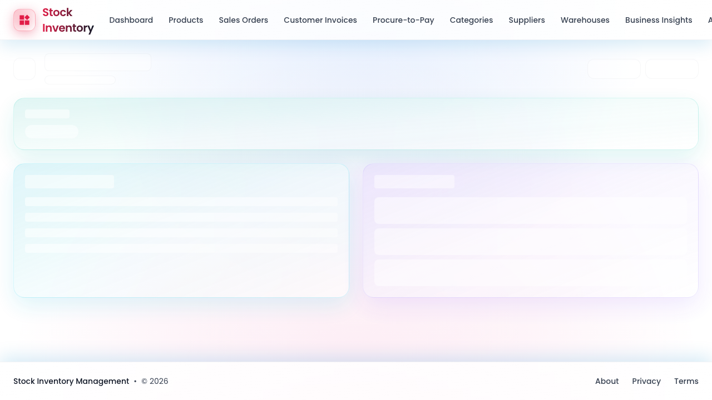

### 4.3 Inventory Ledger Integrity
- **Aktivitas**: Sistem secara ketat menjaga pencatatan buku besar inventori (*Inventory Ledger*) agar seluruh pergerakan mutasi stok terdokumentasi dan tidak bisa diretas.
> 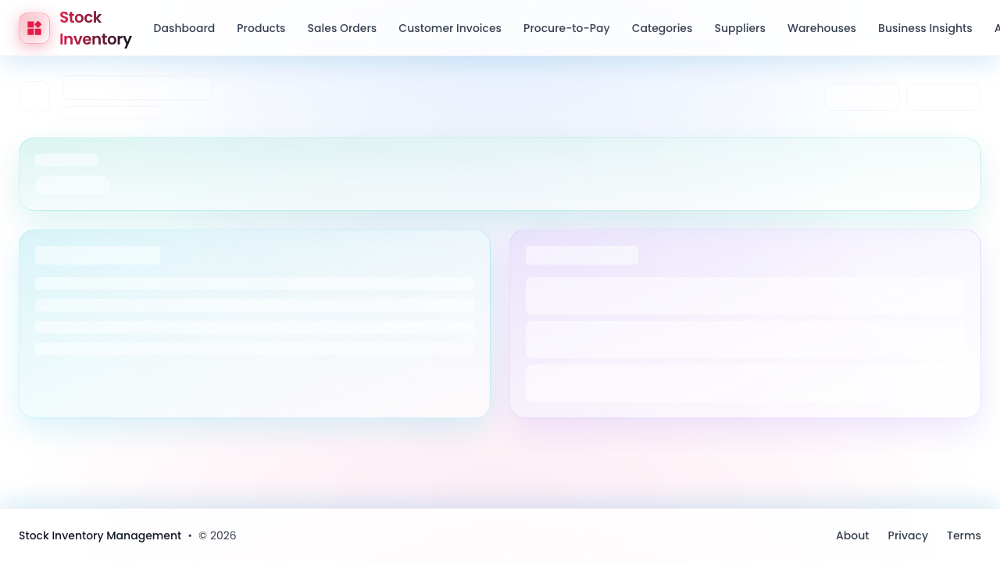

---

## 5. Status Implementasi Teknis & E2E Testing

Aplikasi dibangun menggunakan infrastruktur modern dengan kualitas setara produksi:

- **Stack:** `Next.js 16`, `React 19`, `Prisma`, `MongoDB`, `Tailwind CSS`.
- **Testing Coverage:**
  - **Unit Testing:** `Vitest` (324 test lolos sempurna, menguji validasi, limitasi PO, dll).
  - **E2E Testing:** `Playwright` (Simulasi login multi-peran dan navigasi flow otomatis untuk 12 *Test Scenarios* O2C, P2P, dan Inventory).
- **Code Quality:** Terverifikasi bebas *type error* (TypeScript ketat) dan lulus *Linting*.

---

## 6. Cara Menjalankan Project

1. **Install Dependencies:**
   ```bash
   npm install
   ```

2. **Setup Database (MongoDB):**
   Ubah `DATABASE_URL` di `.env` (atau jalankan MongoDB lokal via Docker/Homebrew).

3. **Migrate / Push Schema:**
   ```bash
   npx prisma db push
   ```

4. **Seed Demo Accounts (Generate User Roles):**
   ```bash
   npx tsx scripts/create-demo-accounts.ts
   ```

5. **Jalankan Aplikasi:**
   ```bash
   npm run dev
   ```

6. **Login Akun:**
   Gunakan email demo seperti `salesmgr@demo.com` atau `aranalyst@demo.com` dengan password `12345678` untuk menguji batasan hak akses sesuai dokumen BPMN.
