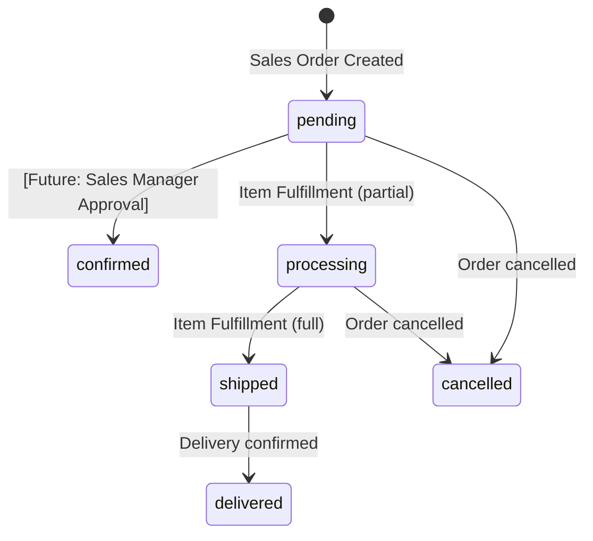
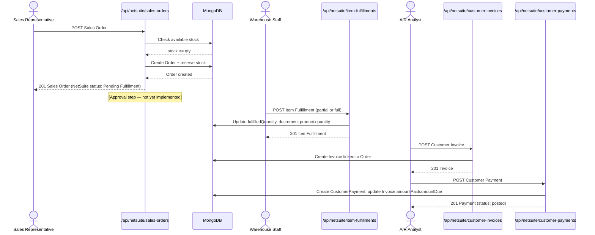
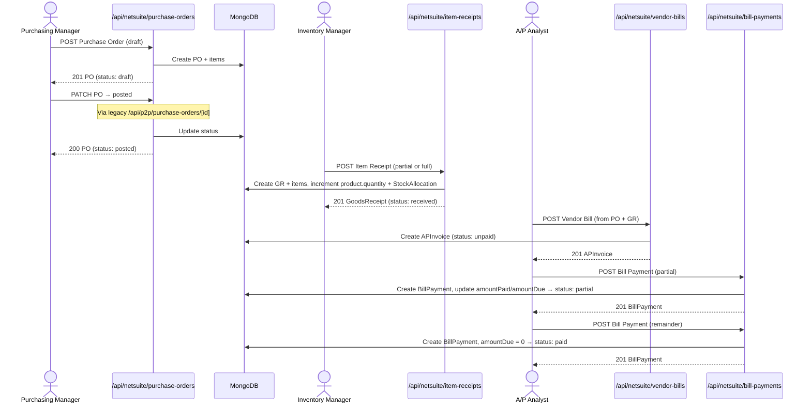
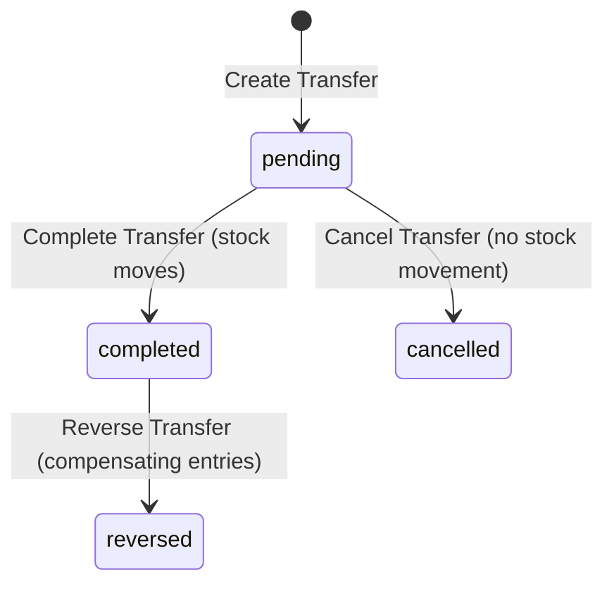
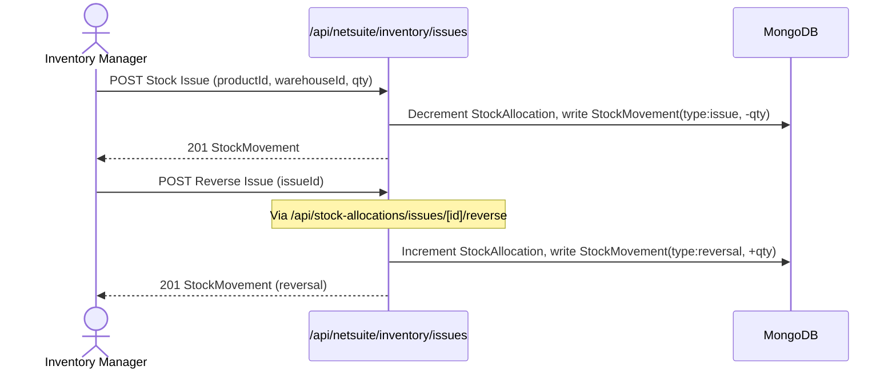

# BUSINESS_FLOW_SPEC.md — Business Process Specification
> Aligned to Oracle NetSuite reference. Verified against actual codebase (2026-06-16).
> Implementation labels are the actual code terms; NetSuite labels are the presentation terms.

---

## 1. O2C (Order-to-Cash)

### Actors
| Actor | Role in Flow | System Role |
|---|---|---|
| Sales Representative | Creates Sales Order | Any authenticated `admin`/`user` |
| Sales Manager | Approves Sales Order | ❌ Not implemented (P1 gap) |
| Warehouse Staff / Fulfillment | Creates Item Fulfillment | Any authenticated `admin`/`user` |
| A/R Analyst / Billing | Creates Customer Invoice | Any authenticated `admin`/`user` |
| A/R Analyst / Billing | Records Customer Payment | Any authenticated `admin`/`user` |

### Preconditions
- Product exists with sufficient available stock: `product.quantity - product.reservedQuantity >= order qty`
- User is authenticated (non-client, non-supplier)

### Postconditions
- Sales Order created: `Order` record, `OrderItem` records, `product.reservedQuantity` incremented
- Fulfillment: `ItemFulfillment` + `ItemFulfillmentItem` records, `OrderItem.fulfilledQuantity` updated, `product.quantity` decremented, `product.reservedQuantity` decremented
- Invoice: `Invoice` record linked to Order (one-to-one)
- Payment: `CustomerPayment` record, `Invoice.amountPaid` incremented, `Invoice.amountDue` decremented

### Status Transitions



**NetSuite Status Mapping** (via `mapOrderToNetSuiteStatus()`):

| Internal State | NetSuite Display Status |
|---|---|
| No fulfillments, unpaid | Pending Fulfillment |
| Some items fulfilled, not all | Partially Fulfilled |
| All items fulfilled, invoice not fully billed | Pending Billing |
| All items billed | Billed |
| Delivered + paid | Closed |
| Cancelled | Cancelled |

**Invoice Status**: `draft` → `sent` → `paid` / `overdue` / `cancelled`
**Payment Status**: `posted` / `void`

### Failure / Rejection / Reversal Paths
- **Oversell**: API returns 400 if requested quantity > available stock. Order not created.
- **Order cancellation**: `Order.cancelledAt` set, reserved stock released.
- **Fulfillment reversal**: `ItemFulfillment.status = "reversed"` — **not yet confirmed in code detail**. Stock rollback behavior TBD.
- **Invoice cancellation**: `Invoice.status = "cancelled"`, `Invoice.cancelledAt` set.
- **Payment void**: `CustomerPayment.status = "void"`.

### Flow Diagram



### BPMN to Implementation Label Mapping
| BPMN Label | Implementation Label | Endpoint |
|---|---|---|
| Sales Order | Order | `POST /api/netsuite/sales-orders` |
| Item Fulfillment | ItemFulfillment | `POST /api/netsuite/item-fulfillments` |
| Customer Invoice | Invoice | `POST /api/netsuite/customer-invoices` |
| Customer Payment | CustomerPayment | `POST /api/netsuite/customer-payments` |

---

## 2. P2P (Procure-to-Pay)

> ⚠️ Terminology: "Procure to Pay" (NOT "Produce to Pay"). If BPMN diagrams say "Produce to Pay", treat it as a labeling error and present as "Procure-to-Pay (P2P)".

### Actors
| Actor | Role in Flow | System Role |
|---|---|---|
| Purchasing Manager | Creates and posts Purchase Order | Any authenticated `admin`/`user` (role enforcement P1 gap) |
| Inventory Manager | Creates Item Receipt (Goods Receipt) | Any authenticated `admin`/`user` |
| A/P Analyst | Creates Vendor Bill (AP Invoice) | Any authenticated `admin`/`user` |
| A/P Analyst | Records Bill Payment | Any authenticated `admin`/`user` |

> ⚠️ **Role Mismatch Note**: The billing and payment side of P2P (Vendor Bill, Bill Payment) must be handled by **A/P Analyst** (Accounts Payable). If any documentation references "A/R Analyst" for vendor bill or payment, that is incorrect. A/R Analyst handles the customer-facing O2C side. These roles do not yet exist in the system.

### Preconditions
- Supplier exists and is active
- Warehouse exists and is active
- Products linked to supplier exist
- Purchase Order in `posted` status before goods receipt

### Postconditions
- PO created: `PurchaseOrder` + `PurchaseOrderItem` records
- PO posted: `PurchaseOrder.status = "posted"`
- Item Receipt: `GoodsReceipt` + `GoodsReceiptItem` records; `product.quantity` incremented; `StockAllocation.quantity` incremented; `PurchaseOrderItem.receivedQuantity` updated
- Vendor Bill: `APInvoice` record linked to PO and/or GR; `status = "unpaid"`
- Bill Payment: `BillPayment` record; `APInvoice.amountPaid` incremented; `APInvoice.amountDue` decremented; status → `"partial"` or `"paid"`
- Storno (GR reversal): `GoodsReceipt.status = "reversed"`; `reversedAt` + `reversedBy` set; `StockMovement` compensating entry written; `product.quantity` decremented; `PurchaseOrderItem.receivedQuantity` rolled back

### Status Transitions

**Purchase Order**:
```
draft → posted → completed
                → cancelled
```

**Goods Receipt**:
```
received → reversed (storno — preserves original record)
```

**AP Invoice (Vendor Bill)**:
```
draft → unpaid → partial → paid
                          → cancelled
```

**Bill Payment**:
```
posted → void
```

### Flow Diagram



### BPMN to Implementation Label Mapping
| BPMN Label | Implementation Label | Endpoint |
|---|---|---|
| Purchase Order | PurchaseOrder | `POST /api/netsuite/purchase-orders` |
| Item Receipt / Goods Receipt | GoodsReceipt | `POST /api/netsuite/item-receipts` |
| Vendor Bill / AP Invoice | APInvoice | `POST /api/netsuite/vendor-bills` |
| Bill Payment | BillPayment | `POST /api/netsuite/bill-payments` |
| Storno / Reverse | GoodsReceipt (status: reversed) | `POST /api/p2p/goods-receipts/[id]/reverse` |

---

## 3. Inventory Management

### Actors
| Actor | Role in Flow | System Role |
|---|---|---|
| Inventory Manager / Admin | Manages stock allocations | Any authenticated `admin`/`user` |
| Warehouse Staff | Performs transfers and issues | Any authenticated `admin`/`user` |

### Preconditions
- Product and warehouse(s) exist and are active
- `StockAllocation` record exists for product+warehouse pair before transfer/issue
- Transfer: source warehouse has sufficient `quantity - reservedQuantity`
- Issue: warehouse has sufficient available allocation

### Postconditions
- **Allocation**: `StockAllocation` upserted for product+warehouse; `StockMovement` NOT written on simple allocation (only on transfer/issue)
- **Transfer (complete)**: Source `StockAllocation.quantity` decremented; dest `StockAllocation.quantity` incremented; two `StockMovement` entries written (`transfer_out`, `transfer_in`)
- **Issue**: `StockAllocation.quantity` decremented; `product.quantity` decremented; `StockMovement` entry written (`issue`)
- **Reversal (any)**: Compensating `StockMovement` entry written. No historical records deleted.

### Status Transitions

**StockTransfer**:
```
pending → completed (stock moves)
        → cancelled (no stock movement)
completed → [reversed via new reversal transfer with reversalOfId set]
```

**StockMovement** (append-only ledger):
```
movementType: receipt | issue | transfer_in | transfer_out | reversal
quantityChange: +N (in) or -N (out)
```

### Inventory Ledger (Stock Card)
- `GET /api/netsuite/inventory/ledger` returns all `StockMovement` records sorted chronologically
- `runningBalance` is computed server-side per `productId:warehouseId` key
- This is the primary audit trail for inventory

### Flow Diagrams

**Transfer Flow**:


**Issue + Reversal Flow**:

