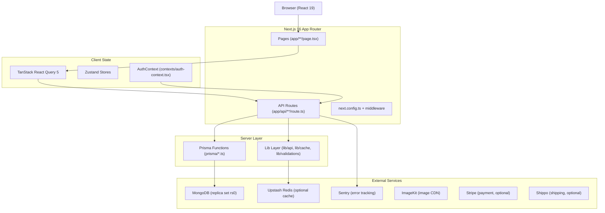

# DESIGN.md — ERP TradeFlow System Design
> Last verified: 2026-06-16. Based on direct inspection of the actual codebase.

---

## 1. System Overview

ERP TradeFlow is an academic-grade enterprise resource planning web application covering three mandatory business domains aligned to Oracle NetSuite terminology:

- **O2C (Order-to-Cash)**: Sales Order → Item Fulfillment → Customer Invoice → Customer Payment
- **P2P (Procure-to-Pay)**: Purchase Order → Item Receipt → Vendor Bill → Bill Payment
- **Inventory Management**: Warehouse allocation, transfers, issues, reversals, and a stock ledger

The application is **not** a full NetSuite clone. It aligns terminology and process flow to NetSuite at the academic scope level, without implementing GL period close, multi-currency, or full accounting engine.

---

## 2. Architecture Diagram



---

## 3. Module Boundaries

| Module | Path | Responsibility |
|---|---|---|
| Pages (O2C) | `app/orders/`, `app/invoices/` | Sales order list/detail, invoice list/detail |
| Pages (P2P) | `app/procurement/` | P2P Workbench |
| Pages (Inventory) | `app/warehouses/` | Warehouse list and per-warehouse inventory workbench |
| Pages (Products) | `app/products/` | Item master management |
| Pages (Suppliers) | `app/suppliers/` | Supplier master management |
| Pages (Admin) | `app/admin/` | User management, system config, audit logs |
| NetSuite API | `app/api/netsuite/` | Primary ERP-aligned endpoints |
| Legacy API | `app/api/p2p/`, `app/api/orders/`, `app/api/stock-allocations/` | Compatibility endpoints (active during transition) |
| Prisma Functions | `prisma/*.ts` | DB access layer with business logic |
| Types | `types/*.ts` | Shared TypeScript types |
| Lib | `lib/` | Validations (Zod), cache (Redis), rate limiting, notifications, email |
| Components | `components/` | UI components organized by domain |
| Contexts | `contexts/` | Auth context |
| Hooks | `hooks/` | Custom React hooks |
| Stores | `stores/` | Zustand global state |
| Scripts | `scripts/` | DB management, seeding, smoke testing |
| Tests | `tests/e2e/` | Playwright E2E tests |

---

## 4. Frontend Structure

```
app/
├── layout.tsx               # Root layout with AuthProvider, QueryClient, Sentry
├── page.tsx                 # Home / redirect page
├── orders/                  # O2C: Sales Orders
├── invoices/                # O2C: Customer Invoices
├── procurement/             # P2P: P2P Workbench
├── warehouses/              # Inventory: Warehouse list + per-warehouse workbench
├── products/                # Item Master
├── suppliers/               # Supplier Master
├── categories/              # Category Master
├── admin/                   # Admin panel
├── login/                   # Auth
├── register/                # Auth
└── api/                     # Next.js API routes (see API Structure)

components/
├── orders/                  # Order list, detail, fulfillment dialogs
├── invoices/                # Invoice components
├── p2p/
│   └── P2PWorkbench.tsx     # Single-component P2P workbench (43KB)
├── warehouses/              # Warehouse list, inventory workbench, transfer/issue dialogs
├── products/                # Product CRUD components
├── payments/                # Payment dialog components
├── shipping/                # Shipping label/tracking components
├── layouts/                 # Sidebar, header, navigation
├── shared/                  # Shared utility components (pagination, search, etc.)
└── ui/                      # Radix UI primitives wrappers (button, card, dialog, etc.)
```

---

## 5. API Structure

### NetSuite-Style Primary Endpoints (`app/api/netsuite/`)
```
/api/netsuite/
├── _shared.ts                   # requireNetSuiteSession(), isForbiddenRole()
├── sales-orders/route.ts         # GET/POST Sales Orders
├── item-fulfillments/route.ts    # GET/POST Item Fulfillments
├── customer-invoices/route.ts    # GET/POST Customer Invoices
├── customer-payments/route.ts    # GET/POST Customer Payments
├── purchase-orders/route.ts      # GET/POST Purchase Orders
├── item-receipts/route.ts        # GET/POST Item Receipts (Goods Receipts)
├── vendor-bills/route.ts         # GET/POST Vendor Bills (AP Invoices)
├── bill-payments/route.ts        # GET/POST Bill Payments
└── inventory/
    ├── allocations/route.ts      # GET/POST Stock Allocations
    ├── transfers/route.ts        # GET/POST Inventory Transfers
    ├── transfers/[id]/route.ts   # GET/PATCH/complete/cancel/reverse
    ├── issues/route.ts           # GET/POST Stock Issues
    ├── issues/[id]/reverse/      # POST Reverse Issue
    └── ledger/route.ts           # GET Inventory Ledger (running balance)
```

### Legacy Compatibility Endpoints (active during transition)
```
/api/orders/                     # Sales Orders (legacy)
/api/invoices/                   # Customer Invoices (legacy)
/api/p2p/purchase-orders/        # Purchase Orders (legacy)
/api/p2p/goods-receipts/         # Item Receipts (legacy)
/api/p2p/ap-invoices/            # Vendor Bills (legacy)
/api/stock-allocations/          # Stock Allocations (legacy)
/api/stock-allocations/transfers/ # Inventory Transfers (legacy)
/api/stock-allocations/issues/   # Stock Issues (legacy)
```

### Authentication
```
/api/auth/login/                 # POST: login, returns session cookie
/api/auth/logout/                # POST: logout
/api/auth/session/               # GET: validate session
```

---

## 6. Service / Data Access Layer

Prisma functions in `prisma/` are the single source of business logic. API routes call them directly (no separate service class layer).

| File | Responsibility |
|---|---|
| `prisma/order.ts` | Sales order CRUD, oversell check, reservation logic |
| `prisma/netsuite.ts` | Item fulfillment, customer invoice, customer payment, vendor bill, bill payment, NetSuite status mapping |
| `prisma/p2p.ts` | Purchase order CRUD, goods receipt + stock increment, AP invoice, serialization |
| `prisma/stock-allocation.ts` | Stock allocation CRUD, transfer lifecycle, stock issues, stock movements (ledger) |
| `prisma/invoice.ts` | Invoice-specific operations |
| `prisma/product.ts` | Product CRUD |
| `prisma/supplier.ts` | Supplier CRUD |
| `prisma/audit-log.ts` | Audit log creation |
| `prisma/client.ts` | Prisma client singleton |

---

## 7. Prisma / MongoDB Data Model (Summary)

See `docs/DATA_MODEL.md` for full detail. Key models:

```
User → Notification
Product → OrderItem, StockAllocation (via productId)
Order → OrderItem, Invoice, ItemFulfillment, CustomerPayment
Invoice → CustomerPayment
PurchaseOrder → PurchaseOrderItem, GoodsReceipt, APInvoice, BillPayment
GoodsReceipt → GoodsReceiptItem, APInvoice
APInvoice → BillPayment
ItemFulfillment → ItemFulfillmentItem
StockAllocation (productId, warehouseId) — unique per pair
StockTransfer — self-referencing via reversalOfId / reversalTransferId
StockMovement — append-only ledger (never deleted)
AuditLog — append-only action log
```

---

## 8. Auth and Role Design

### Session Mechanism
- Custom JWT-like cookie session (`session_id` cookie)
- Server: `getSessionFromRequest(request)` from `utils/auth.ts`
- Client: `getSessionClient()` from `utils/auth.client.ts`; stored in `localStorage` for fast hydration

### Role Model
```typescript
// User.role (nullable — null treated as "user")
type UserRole = "user" | "admin" | "supplier" | "client" | "retailer"
```

### Authorization Pattern
| Scope | Check | File |
|---|---|---|
| Any authenticated user | `getSessionFromRequest(request)` — returns 401 if not logged in | Most API routes |
| Block client/supplier from ERP ops | `isForbiddenRole(session.role)` — returns 403 | `_shared.ts`, P2P routes |
| Admin-only actions | `session.role === "admin"` | User management, system config |

> ⚠️ Fine-grained ERP roles (Purchasing Manager, A/P Analyst, etc.) are **not yet implemented**.

---

## 9. State Management / Data Fetching

- **Server state**: TanStack React Query 5 (caching, invalidation)
- **Global client state**: Zustand (`stores/`)
- **Auth state**: React Context (`contexts/auth-context.tsx`)
- **Cache strategy**:
  - Server-side: Upstash Redis with `getCache` / `setCache` / `invalidateAllServerCaches()`
  - Client-side: React Query with `invalidateAllRelatedQueries(queryClient)` from `lib/react-query`
- **Cache invalidation test**: `lib/react-query/invalidate-coverage.test.ts` — enforces that every write API route calls `invalidateAllServerCaches()`

---

## 10. Error Handling

- All API routes return `{ error: "..." }` JSON with appropriate HTTP status
- All errors logged via `lib/logger` (wraps Sentry in production)
- Non-blocking operations (email, notifications, external APIs) use `.catch(console.error)` or `.catch(logger.error)` to avoid failing the main request
- Rate limiting via `withRateLimit()` from `lib/api/rate-limit` — returns 429 on exceeded

---

## 11. Audit Trail / Reversal Design

| Operation | How Preserved |
|---|---|
| GoodsReceipt reversal | `status: "reversed"`, `reversedAt`, `reversedBy` set on original record. New `StockMovement` entry with negative `quantityChange`. |
| StockTransfer reversal | Original transfer `reversalTransferId` set. New reversal transfer with `reversalOfId` set. New `StockMovement` entries compensate. |
| StockIssue reversal | New `StockMovement` entry with positive `quantityChange` and `movementType: "reversal"`. |
| Order cancellation | `cancelledAt` timestamp set. Stock reservation released. |
| AuditLog | `AuditLog` model records create/update/delete actions with `userId`, `entityType`, `entityId`, `details`. Used in orders currently; not confirmed for all operations. |

> **Rule**: Historical records are never deleted. Reversal creates compensating entries.

---

## 12. Demo Flow Design

| Phase | Duration | Pages Used | Key Operations |
|---|---|---|---|
| O2C | 0:00–2:30 | `/orders`, `/invoices` | Create Sales Order → Fulfill → Invoice → Pay |
| P2P | 2:30–5:00 | `/procurement` | Create PO → Post → Item Receipt → Vendor Bill → Pay |
| Inventory | 5:00–8:00 | `/warehouses/[id]` | Transfer → Complete → Reverse → Issue → Reverse → Ledger |
| Compatibility | 8:00–9:00 | — | Show TS-12 evidence |

See `docs/DEMO_SCRIPT.md` for exact steps.

---

## 13. Known Constraints

| Constraint | Impact |
|---|---|
| MongoDB requires replica set for transactions | Local dev must use `?replicaSet=rs0` in DATABASE_URL |
| `npm test` currently fails (74 test cases) | Invalidation coverage test not updated for new NetSuite routes |
| Branch 43 commits behind origin/main | Must `git pull` before submission |
| Redis, ImageKit, Sentry are optional | App works without them; warnings appear in logs |
| No ERP-specific roles (Purchasing Mgr, AP Analyst) | All internal ops accessible to any authenticated non-client/supplier user |
| No Sales Order Approval step | O2C does not include a manager approval gate |
| P2PWorkbench calls legacy `/api/p2p/*` | UI-to-NetSuite-endpoint gap for P2P |
| `product.quantity` vs `StockAllocation.quantity` dual tracking | Potential double-counting risk if not updated atomically |
