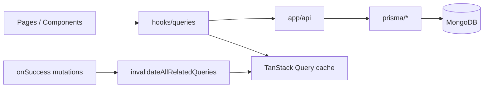
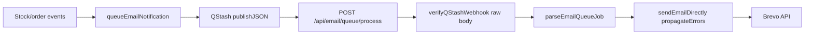

# PROJECT_WALKTHROUGH.md

Agent-oriented map of **stock-inventory** (Stockly). Last updated: 2026-05-19 (pre-commit audit re-run).

## 1. What this app is

Role-based inventory platform (admin / supplier / client): products, orders, invoices, warehouses, support tickets, Stripe, Shippo, Brevo, optional Redis cache and Sentry monitoring.

**Live:** <https://stockly-inventory.vercel.app/>

## 2. Repo map (high level)

```bash
app/              → pages + app/api/* route handlers
components/       → UI (ui/, Pages/, admin/, shared/, providers/)
hooks/queries/    → TanStack Query hooks + mutations
contexts/         → auth context
lib/              → api, auth, cache, email, monitoring, react-query, server, validations
prisma/           → schema + data access helpers
types/            → shared TS types
instrumentation.ts + instrumentation-client.ts → Sentry + Redis/QStash boot
```

## 3. Request & state flow



- **Reads:** query hooks → `lib/api` client → API routes → Prisma
- **Writes:** mutations → API → Redis invalidation on server → client `invalidateAllRelatedQueries` on success
- **Deletes:** `cancelOrRemoveDetailQuery` then broad invalidation (no refetch 404 while detail page mounted)
- **Prefetch / persistence:** `lib/react-query/provider.tsx`, keys in `config.ts`

## 4. Product delete (implemented)

| Case | API | UI |
|------|-----|-----|
| Shipped/pending order | 409 + message | Toast shows error |
| Delivered/cancelled only | 200 `{ mode: "soft" }` | Archived toast; hidden from lists |
| Never ordered | 200 `{ mode: "hard" }` | Removed from DB |

- Filter: `lib/products/product-query.ts` → `deletedAt` null OR unset (legacy MongoDB rows)
- Tests: `npm run test` (delete-policy, prisma-errors, imagekit-errors)

## 5. Sentry monitoring (implemented)

| Layer    | File                                                          | Role                                                          |
| -------- | ------------------------------------------------------------- | ------------------------------------------------------------- |
| Config   | `lib/monitoring/sentry-config.ts`                             | DSN, tunnel `/api/monitoring`, scrubbing, sample rates        |
| Wrappers | `lib/monitoring/sentry.ts`                                    | `captureException`, `captureMessage`, user/breadcrumb helpers |
| Client   | `instrumentation-client.ts`                                   | `Sentry.init`, replay, browser tracing, tunnel                |
| Server   | `sentry.server.config.ts`                                     | Node/API/SSR                                                  |
| Edge     | `sentry.edge.config.ts`                                       | Edge runtime (if used)                                        |
| Boot     | `instrumentation.ts`                                          | Loads server/edge config; `onRequestError`                    |
| Build    | `next.config.ts`                                              | `withSentryConfig`, `tunnelRoute: /api/monitoring`            |
| Errors   | `app/global-error.tsx`, `components/shared/ErrorBoundary.tsx` | Uncaught + React errors                                       |
| API      | `lib/api/response-helpers.ts`                                 | 5xx → Sentry                                                  |
| Logs     | `lib/logger.ts`                                               | Production errors/warnings → Sentry                           |

**Verification checklist (manual):**

1. `NEXT_PUBLIC_SENTRY_DSN` + `SENTRY_DSN` set on Vercel → redeploy production
2. Browse prod site → Network tab shows POSTs to `/api/monitoring` (not blocked ingest host)
3. Sentry project **stock-inventory** → Issues / Performance show events within ~5 min

**User context:** `contexts/auth-context.tsx` calls `syncSentryUserFromAuth` on session (id, email, role tag).

**Wizard artifacts:** `.env.sentry-build-plugin` (gitignored) for local source map upload; `sentry.client.config.ts` is compatibility stub only.

## 6. Other optional integrations

| Service | Lib / entry                            | Env (optional)                  |
| ------- | -------------------------------------- | ------------------------------- |
| Redis   | `lib/cache/redis.ts`, `cache-utils.ts` | `UPSTASH_REDIS_*`               |
| QStash  | `lib/queue/qstash.ts`, `lib/queue/qstash-webhook.ts` | `QSTASH_*` (incl. signing keys) |
| Email   | `lib/email/queue.ts` → webhook `app/api/email/queue/process/route.ts` | `BREVO_*`, `NEXT_PUBLIC_API_URL` |
| Stripe  | `lib/stripe/`                          | `STRIPE_*`                      |
| PostHog | Not implemented                        | See integration guide checklist |

Details: `docs/Redis_Sentry_PostHog_INTEGRATION_GUIDE.md`

## 7. TanStack invalidation (2026-05-19)

| Piece | File |
|-------|------|
| Query keys | `lib/react-query/config.ts` |
| Broad invalidation | `lib/react-query/invalidate-all.ts` — `lists()` for catalog entities; `.all` for invoices, reviews, tickets, history, portal, etc. |
| Safe delete cleanup | `lib/react-query/cancel-or-remove-detail.ts` — used by all 9 delete hooks |
| Static audit | `lib/react-query/invalidate-coverage.test.ts` — run `npm run test:invalidate` |
| Server Redis | `lib/cache/cache-utils.ts` → `invalidateAllServerCaches` / domain helpers on API writes |

**Rules:** new mutation hook → `invalidateAllRelatedQueries` on success (or document exception). New API write → server cache invalidation. New delete hook → `cancelOrRemoveDetailQuery` + broad invalidation.

**Exempt webhooks (no Redis/TanStack):** `app/api/email/queue/process/route.ts`, auth, AI insights, shipping rates, notifications POST — see `API_WRITE_EXEMPT` in invalidate-coverage test.

## 7b. Table pagination Select (Radix portal, 2026-05-22)

| Piece | File |
|-------|------|
| Defer hook | `hooks/use-deferred-radix-select.ts` |
| Page-size UI | `components/shared/PaginationSelector.tsx`, `pagination-select-styles.ts` |
| Consumers | All `*Table.tsx` footers (`variant` + `enabled={!isLoading}`) |

Prevents `NotFoundError: removeChild` when App Router navigates between pages while a Radix `SelectPortal` is active (Sentry: `/orders` after `/products`). Rows-per-page change resets `pageIndex` to 0. Filter/search shrink uses `hooks/use-clamp-pagination-index.ts` to clamp `pageIndex` to the last valid page.

## 7c. QStash email queue (2026-05-19)



- **Fix:** request body consumed once (`text()` → verify → `JSON.parse`); fixes Sentry `Body has already been read`
- **Security:** `Receiver.verify` with `QSTASH_CURRENT_SIGNING_KEY` / `QSTASH_NEXT_SIGNING_KEY`
- **Retries:** webhook 500 on send failure → QStash retries; direct fallback in `queueEmailNotification` still logs-only on error

## 8. Quality gates (audit 2026-05-19, re-verified)

| Check | Status |
|-------|--------|
| `npm run lint` | pass |
| `npm run build` | pass |
| `npm run test` | 217 passed |
| `npm run test:invalidate` | 200 passed |
| Product delete | soft/hard/409 + no post-delete GET 404 on detail |
| QStash email webhook | single body read + Receiver + tests in `qstash-webhook.test.ts` |
| Radix table Select | `useDeferredRadixSelect` + shared `PaginationSelector` on all tables |
| Sentry | `/api/monitoring` tunnel |
| Hydration | `ClientDateDisplay`, `format-stable.ts` |
| Vercel headers | `lib/vercel/production-headers.ts` |
| Python | N/A |

**Gaps (OK):** Sentry user context optional; archived SKU unique; export-only `toLocaleDateString`; optional `use-deferred-radix-select.test.ts`.

**Pending commit:** Radix table Select refactor (hook + `PaginationSelector` + 11 tables + `OrderList` static import) — lint/test/build/invalidate all pass locally.

**Manual QA:** soft-delete from product detail (1 DELETE, no GET 404); cross-page list refresh without reload; prod email queue after deploy (no Sentry body-read error); `/products` → `/orders` (no removeChild).

## 9. When changing code

- **New API route:** `successResponse` / `errorResponse`; server cache invalidation on writes
- **New mutation hook:** `invalidateAllRelatedQueries`; delete → `cancelOrRemoveDetailQuery` first
- **New API write route:** add to `API_WRITE_ROUTE_INVALIDATION_SPEC` in invalidate-coverage test (or exempt list)
- **Sentry:** `SENTRY_TUNNEL_PATH` in sync (`sentry-config.ts`, `next.config.ts`)
- **Env:** update `.env.example` + `CLAUDE.md` + this file

## 10. Related docs

- `CLAUDE.md` — condensed agent rules
- `README.md` — user-facing setup and API list
- `docs/Redis_Sentry_PostHog_INTEGRATION_GUIDE.md` — step-by-step integrations
